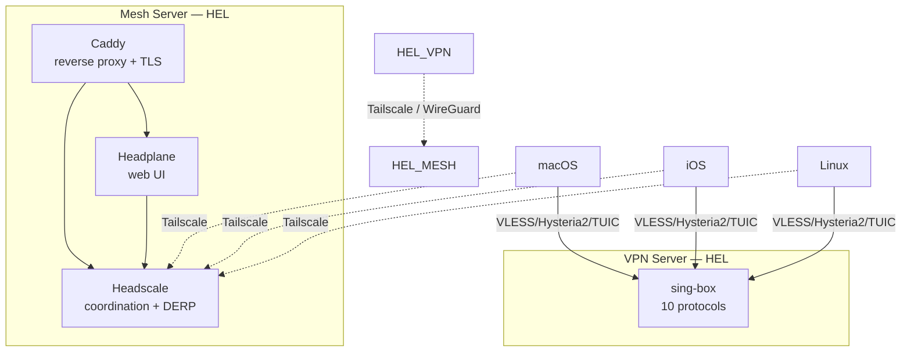

# lab-private

Personal infrastructure as code: VPN server (sing-box, 10 protocols) and mesh network (headscale + headplane + caddy). Deployed with Docker Compose via GitHub Actions on self-hosted runners. Infrastructure managed with Terraform (Hetzner Cloud + Cloudflare DNS).

## Architecture



### Protocols (VPN Server)

| Protocol | Port | Transport |
|----------|------|-----------|
| VLESS Reality gRPC | 443/tcp | gRPC, SNI: www.microsoft.com |
| VLESS Reality gRPC | 2053/tcp | gRPC, SNI: dl.google.com |
| VLESS Reality gRPC | 2083/tcp | gRPC, SNI: www.samsung.com |
| VLESS Reality gRPC | 64444/tcp | gRPC, SNI: learn.microsoft.com |
| VLESS Reality HTTPUpgrade | 2087/tcp | HTTPUpgrade, SNI: www.logitech.com |
| Hysteria2 + Salamander | 8443/udp | QUIC + obfuscation |
| TUIC v5 | 8444/udp | QUIC |
| ShadowTLS v3 + SS2022 | 8388/tcp | ShadowTLS + Shadowsocks |
| Trojan | 8445/tcp | TLS |
| Shadowsocks 2022 | 8389/tcp | Direct |

### Mesh Server

| Service | Port | Purpose |
|---------|------|---------|
| Caddy | 80, 443/tcp | HTTPS reverse proxy, ACME, client config distribution |
| Headscale | 3478/udp | STUN, embedded DERP relay |
| Headplane | internal | Web UI for headscale management |

### Backups

Headscale SQLite database backed up weekly (Sunday 03:00) via systemd timer:
- Local: `/opt/backups/headscale/` on mesh server
- Remote: copied to VPN server via Tailscale (SCP)
- Retention: 8 weeks

## Repository Structure

```
configs/
  vpn/<server>/               # Per-server VPN configs
    docker-compose.yaml
    caddy/Caddyfile.tpl
    sing-box/
      config.json.tpl          # Server config template
      client-base.jsonnet       # macOS client (imports shared libs)
      client-mobile.jsonnet     # iOS client
      client-linux.jsonnet      # Linux client
  mesh/<server>/              # Per-server mesh configs
    docker-compose.yaml
    caddy/Caddyfile.tpl
    headscale/config.yaml.tpl
    headplane/config.yaml.tpl
templates/
  sing-box/
    lib/
      outbounds.libsonnet      # Shared outbound definitions
      route.libsonnet          # Shared route rules and rule sets
terraform/
  versions.tf                 # Providers + Terraform Cloud backend
  variables.tf                # Input variables
  main.tf                     # SSH keys, runner cleanup, server modules
  secrets.tf                  # GitHub environments + per-server secrets
  outputs.tf                  # Server IPs and FQDNs
  cloud-init/                 # Server bootstrap templates
  modules/hcloud-server/      # Reusable server module (server + firewall + DNS)
.github/workflows/
  deploy-vpn.yml              # VPN deploy trigger
  deploy-mesh.yml             # Mesh deploy trigger
  _deploy-vpn.yml             # Reusable VPN deploy workflow
  _deploy-mesh.yml            # Reusable mesh deploy workflow
  terraform.yml               # Terraform CI/CD
```

## Quick Start

### 1. Infrastructure (Terraform)

Servers are managed via Terraform with HCP Terraform Cloud backend:

```bash
cd terraform
terraform init
terraform plan
terraform apply
```

Adding a new server = one entry in `terraform.tfvars`:

```hcl
vpn_servers = {
  hel-01 = {
    location  = "hel1"
    type      = "cax11"
    tcp_ports = [443, 2053, 2083, 64444, 2087, 8388, 8389, 8445]
    udp_ports = [3478, 8443, 8444]
  }
}
```

### 2. Client configs (Jsonnet)

Per-server `.jsonnet` files in `configs/vpn/<server>/sing-box/` import shared libraries from `templates/sing-box/lib/`:

```bash
jsonnet --jpath templates/sing-box -o output.json configs/vpn/hel-01/sing-box/client-base.jsonnet
```

In CI, this runs automatically during deploy.

### 3. Deploy

Push to `master` triggers auto-deploy via GitHub Actions:

- Changes in `configs/vpn/<server>/` or `templates/sing-box/` -> deploy VPN
- Changes in `configs/mesh/<server>/` -> deploy mesh
- Changes in `terraform/` -> Terraform plan/apply

Manual deploy: trigger workflows via GitHub Actions UI (`workflow_dispatch`).

## CI/CD Pipeline

### VPN Deploy

1. **Install jsonnet** - downloads go-jsonnet if not present
2. **Generate** - Jsonnet -> `.json.tpl` client templates
3. **Validate** - `docker compose config` syntax check
4. **Render** - `envsubst` replaces `${VAR}` in all `.tpl` files
5. **Upload artifacts** - client configs as GitHub artifacts (7 days)
6. **Sync** - `rsync` to `/opt/lab-private/` on the server
7. **Deploy** - `docker compose up -d`
8. **Verify** - all containers are running

### Terraform

1. **Format check** - `terraform fmt -check`
2. **Validate** - `terraform validate`
3. **Plan** - on PRs, posts plan as comment
4. **Apply** - on push to master (auto-approve)

## License

MIT
