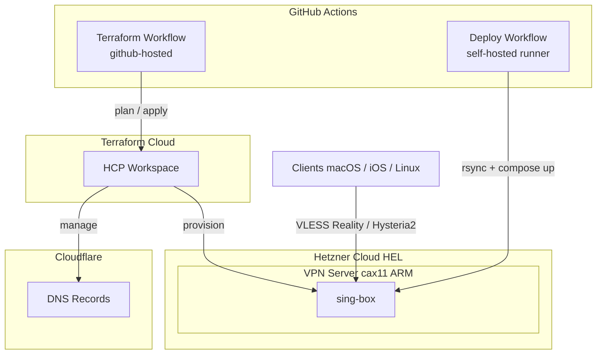

# vpn-infra

[](https://github.com/CosmDandy/vpn-infra/actions/workflows/terraform.yml)
[](https://github.com/CosmDandy/vpn-infra/actions/workflows/deploy-vpn-hel-01.yml)


Personal VPN infrastructure managed entirely as code. Full lifecycle automation — from server provisioning to config deployment — using Terraform, GitHub Actions, and Docker Compose on Hetzner Cloud.

## Tech Stack

| Layer | Tools |
|-------|-------|
| Infrastructure | [Terraform Cloud](https://app.terraform.io), [Hetzner Cloud](https://www.hetzner.com/cloud) (ARM), [Cloudflare DNS](https://www.cloudflare.com) |
| Provisioning | cloud-init (Docker, self-hosted runner, kernel tuning) |
| Deployment | GitHub Actions self-hosted runners, Docker Compose v2 |
| VPN | [sing-box](https://sing-box.sagernet.org) (VLESS Reality, Hysteria2) |
| Configuration | [Jsonnet](https://jsonnet.org) templates, envsubst |
| Backup | rclone to Hetzner S3 Object Storage |

## Architecture



## How It Works

### Infrastructure Provisioning

One entry in `terraform.tfvars` = fully provisioned server with firewall, DNS, GitHub environment, secrets, and self-hosted runner:

```hcl
vpn_servers = {
  hel-01 = {
    location  = "hel1"
    type      = "cax11"
    tcp_ports = [8446, 2053]
    udp_ports = [443]
  }
}
```

What Terraform creates per server:
- Hetzner Cloud server with cloud-init bootstrap
- Firewall with exact port rules (TCP/UDP)
- Cloudflare DNS A-record (`<name>.vpn.cosmdandy.dev`)
- GitHub Actions environment with auto-generated secrets (UUID, passwords, keys)
- Self-hosted runner registration (with cleanup on `terraform destroy`)

### Server Bootstrap

cloud-init provisions each server on first boot:
- Docker CE + Compose v2
- GitHub Actions self-hosted runner (labeled per server)
- Kernel tuning: BBR, fq qdisc, enlarged UDP/TCP buffers, high conntrack limits
- Hardened SSH + unattended-upgrades + automatic reboot on panic

### Deployment Pipeline

Push to `master` triggers deploy on self-hosted runner:

1. Compile `.jsonnet` client configs using shared libraries
2. Validate `docker-compose.yaml` syntax
3. Render `.tpl` templates via `envsubst` with environment secrets
4. `rsync` configs to server, `docker compose up -d`
5. Verify all containers are running

Generated client configs are uploaded as GitHub artifacts (7-day retention).

### Terraform Pipeline

| Event | Action |
|-------|--------|
| Pull request | `fmt -check` + `validate` + `plan` (posted as PR comment) |
| Push to master | Auto-apply |

### Client Configuration

Jsonnet with shared libraries generates per-platform sing-box configs:

- **macOS** — TUN mode, split routing
- **iOS** — strict routing, tuned DNS timeouts
- **Linux** — mixed inbound (HTTP/SOCKS5), Docker-aware routing

## Repository Structure

```
terraform/
  versions.tf                # Providers + Terraform Cloud backend
  variables.tf               # Input variables
  main.tf                    # Server modules, runner lifecycle
  secrets.tf                 # GitHub environments + auto-generated secrets
  outputs.tf                 # Server IPs and FQDNs
  modules/hcloud-server/     # Reusable module: server + firewall + DNS
  cloud-init/                # Server bootstrap templates
configs/vpn/<server>/
  docker-compose.yaml        # sing-box container definition
  sing-box/config.json.tpl   # Server config template
  sing-box/client-*.jsonnet  # Per-platform client configs
templates/sing-box/lib/
  outbounds.libsonnet        # Shared outbound definitions
  route.libsonnet            # Shared route rules and rule sets
.github/workflows/
  terraform.yml              # Terraform CI/CD (github-hosted)
  deploy-vpn-*.yml           # Per-server deploy triggers
  _deploy-vpn.yml            # Reusable deploy workflow (self-hosted)
```

## License

MIT
