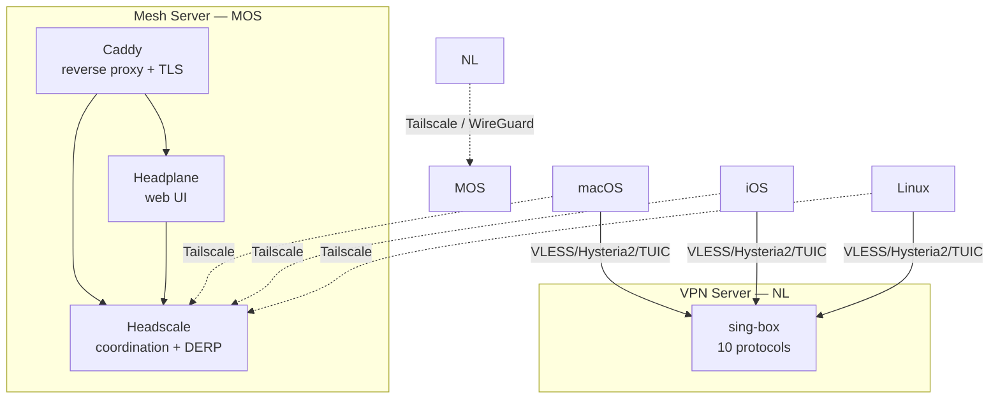

# lab-private

Personal infrastructure as code: VPN server (sing-box, 10 protocols) and mesh network (headscale + headplane + caddy). Deployed with Docker Compose via GitHub Actions on self-hosted runners.

## Architecture



### Protocols (VPN Server)

| Protocol | Port | Transport |
|----------|------|-----------|
| VLESS Reality gRPC | 443/tcp | gRPC, SNI: www.microsoft.com |
| VLESS Reality gRPC | 2053/tcp | gRPC, SNI: dl.google.com |
| VLESS Reality gRPC | 2083/tcp | gRPC, SNI: www.samsung.com |
| VLESS Reality gRPC | 64444/tcp | gRPC, SNI: learn.microsoft.com |
| VLESS Reality HTTPUpgrade | 2087/tcp | HTTPUpgrade, SNI: www.logitech.com |
| Hysteria2 + Salamander | 8443/udp | QUIC + obfuscation |
| TUIC v5 | 8444/udp | QUIC |
| ShadowTLS v3 + SS2022 | 8388/tcp | ShadowTLS + Shadowsocks |
| Trojan | 8445/tcp | TLS |
| Shadowsocks 2022 | 8389/tcp | Direct |

### Mesh Server

| Service | Port | Purpose |
|---------|------|---------|
| Caddy | 80, 443/tcp | HTTPS reverse proxy, ACME, client config distribution |
| Headscale | 3478/udp | STUN, embedded DERP relay |
| Headplane | internal | Web UI for headscale management |

### Backups

Headscale SQLite database backed up weekly (Sunday 03:00) via systemd timer:
- Local: `/opt/backups/headscale/` on MOS
- Remote: copied to VPN server via Tailscale (SCP)
- Retention: 8 weeks

## Repository Structure

```
infra/
  vpn-nl/                    # VPN server (Netherlands)
    docker-compose.yaml
    configs/sing-box/
      config.json.tpl         # Server config template
  mesh-mos/                   # Mesh server (Moscow)
    docker-compose.yaml
    configs/
      headscale/config.yaml.tpl
      headplane/config.yaml.tpl
      caddy/Caddyfile.tpl
clients/
  sing-box/                   # Client configs (generated from Jsonnet)
    lib/outbounds.libsonnet   # Outbound definitions
    lib/route.libsonnet       # Route rules and rule sets
    client-base.jsonnet       # macOS
    client-mobile.jsonnet     # iOS
    client-linux.jsonnet      # Linux
    Makefile
ansible/
  roles/
    common/                   # Base packages, locale, jsonnet
    docker/                   # Docker CE installation
    tailscale/                # Tailscale client management
    backup/                   # Headscale backup timer
    ufw/                      # Firewall rules (idempotent reset)
  playbooks/
    provision.yml             # Full server provisioning
    tailscale.yml             # Tailscale install/authorize
  inventory/
    hosts.yml
    group_vars/
scripts/                      # Utility and backup scripts
docs/                         # Documentation
```

## Quick Start

### 1. Clone and configure

```bash
git clone <repo-url>
cd lab-private
cp .env.example .env          # Fill in your values
cp ansible/inventory/hosts.yml.example ansible/inventory/hosts.yml
```

### 2. Set GitHub secrets

Required repository secrets and variables — see `.env.example` for the full list.

### 3. Provision servers (Ansible)

```bash
ansible-playbook ansible/playbooks/provision.yml -e target_hosts=mesh_mos --diff
ansible-playbook ansible/playbooks/provision.yml -e target_hosts=vpn_nl --diff
```

After provisioning NL, join Tailscale manually:
```bash
ssh nl 'tailscale up --login-server=https://<MESH_DOMAIN>'
```

### 4. Generate client configs

```bash
cd clients/sing-box
make        # Requires jsonnet (go-jsonnet)
```

### 5. Deploy

Push to `master` triggers auto-deploy via GitHub Actions:

- Changes in `infra/vpn-nl/` or `clients/sing-box/` → deploy to VPN server
- Changes in `infra/mesh-mos/` or `clients/sing-box/` → deploy to Mesh server

Manual deploy: trigger workflows via GitHub Actions UI (`workflow_dispatch`).

## CI/CD Pipeline

Each deploy workflow:

1. **Validate** — `docker compose config` syntax check
2. **Generate** — Jsonnet → `.json.tpl` client templates
3. **Render** — `envsubst` replaces `${VAR}` in all `.tpl` files
4. **Upload artifacts** — client configs as GitHub artifacts (7 days)
5. **Sync** — `rsync` to `/opt/lab-private/` on the server
6. **Deploy** — `docker compose up -d`
7. **Healthcheck** — verify all containers are running
8. **Firewall** — idempotent UFW rules

## Self-Hosted Runner Setup

See [runner setup guide](README.md#setting-up-a-new-runner) — create user, configure sudoers, install runner, register with labels matching server hostname.

## License

MIT
